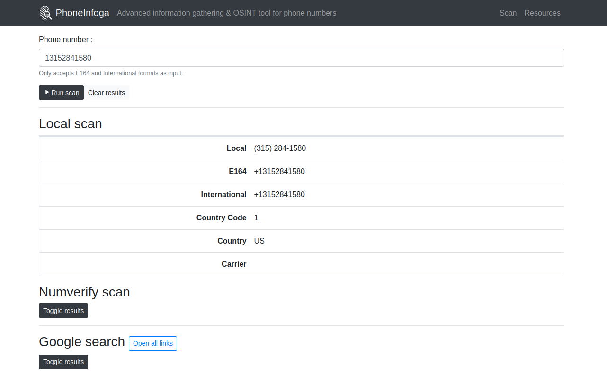

  

  
  
  
  
  

<h4 align="center">Information gathering & OSINT reconnaissance tool for phone numbers</h4>

  <a href="https://sundowndev.github.io/PhoneInfoga/">Documentation</a> •
  <a href="https://sundowndev.github.io/PhoneInfoga/usage/">Basic usage</a> •
  <a href="https://sundowndev.github.io/PhoneInfoga/resources/">OSINT resources</a> •
  <a href="https://medium.com/@SundownDEV/phone-number-scanning-osint-recon-tool-6ad8f0cac27b">Related blog post</a>

## About

PhoneInfoga is one of the most advanced tools to scan phone numbers using only free resources. The goal is to first gather standard information such as country, area, carrier and line type on any international phone numbers with a very good accuracy. Then search for footprints on search engines to try to find the VoIP provider or identify the owner.

## Features

- Check if phone number exists and is possible
- Gather standard informations such as country, line type and carrier
- OSINT footprinting using external APIs, Google Hacking, phone books & search engines
- Check for reputation reports, social media, disposable numbers and more
- Scan several numbers at once
- Use custom formatting for more effective OSINT reconnaissance
- Automatic footprinting on several custom formats
- **NEW**: Serve a web GUI to inspect results from the browser

## License

This tool is licensed under the GNU General Public License v3.0.

[Icon](https://www.flaticon.com/free-icon/fingerprint-search-symbol-of-secret-service-investigation_48838) made by <a href="https://www.freepik.com/" title="Freepik">Freepik</a> from <a href="https://www.flaticon.com/" title="Flaticon">flaticon.com</a> is licensed by <a href="http://creativecommons.org/licenses/by/3.0/" title="Creative Commons BY 3.0" target="_blank">CC 3.0 BY</a>.
